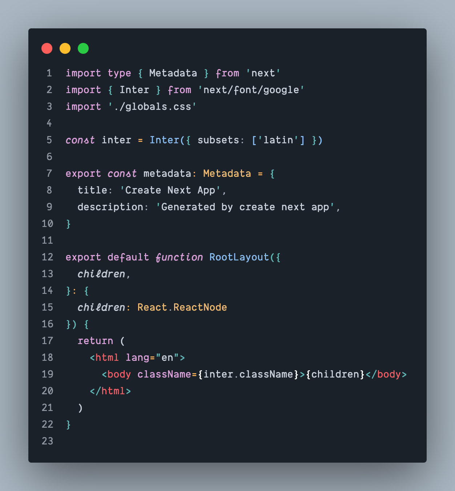
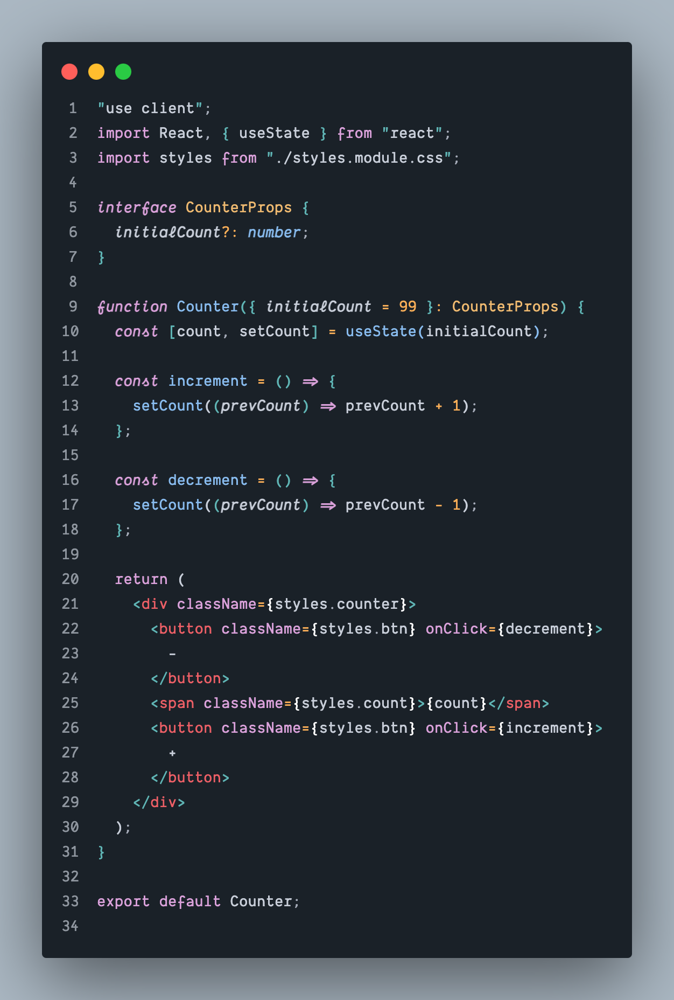
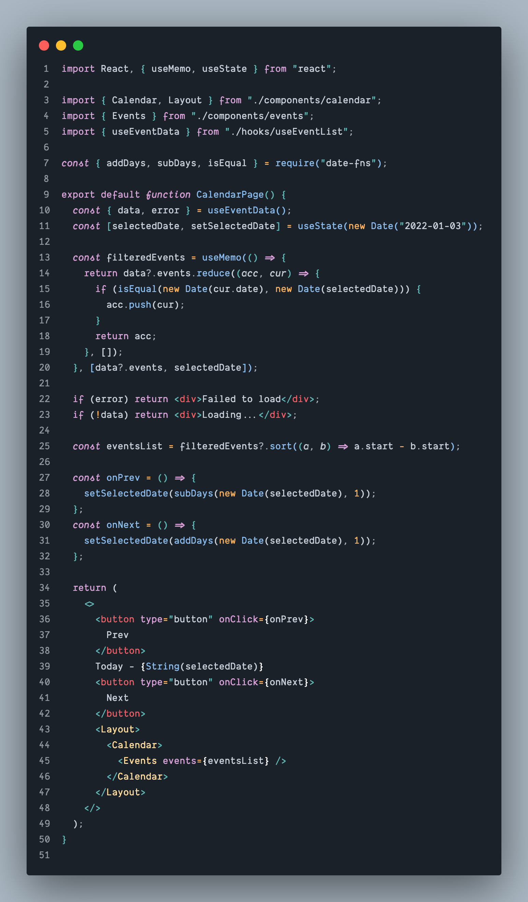

# Qara Theme

Minimalistic fork of [Oceanic Next Color Scheme](https://github.com/voronianski/oceanic-next-color-scheme) from Sublime Text, built with theme with less colors

Credits also to fantastic [Gatito theme](https://github.com/pawelgrzybek/gatito-theme)

## Installation
1. Install VSCode
1. Open the "Extensions" menu on the sidebar
2. Type "QARA Theme" into the search input
3. Click install
4. Press `⌘ + k + ⌘ + t`
5. Select "QARA" theme from the list

## Preview

